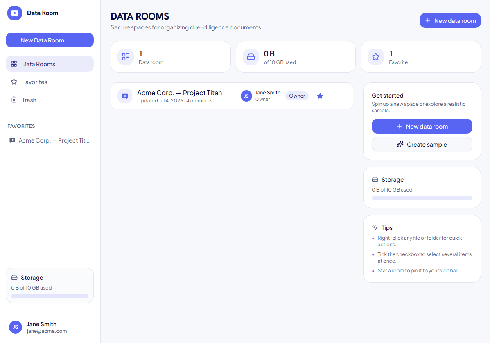

# Data Room

A virtual data room for due diligence: organize documents into **data rooms →
folders → PDF files**, then browse, search and read them. Built as a
production-shaped monorepo.



## Quick start

```bash
bun install
bun run dev
```

Open **http://localhost:5173**. Runs against an in-browser mock API (MSW) by
default, so **no database or backend needed** to click through the whole
product. Empty first screen? Hit **Create sample data room** for a realistic
Acme structure to explore.

## What it does

- **Data rooms & folders** — create, rename, nest to any depth, delete (cascades
  with an impact count).
- **PDF files** — upload (multi-file + drag-and-drop), in-app viewer, rename,
  move, delete. Duplicate names auto-suffix.
- **Find & organize** — search, breadcrumbs, multi-select + bulk actions,
  favorites, members, activity, storage usage.
- **URL is the state** — data room, folder and search all live in the URL, so
  refresh, deep-link and back/forward just work.
- **Polish** — loading skeletons, empty states with CTAs, toasts on every
  mutation, light/dark theme (persisted, no flash).

Every visible control does something real. No placeholders, no dead buttons.

## Stack

Bun workspaces + Turborepo. React 19 · TypeScript · Vite · Tailwind v4 ·
shadcn/ui (`apps/web`), NestJS 11 + PostgreSQL + Drizzle (`apps/api`), and a
type-safe generated API client (OpenAPI → Orval → TanStack Query).

```
apps/web      React SPA (the product)
apps/api      NestJS API (Postgres-backed)
packages/     contracts · db · domain · ui · config · api-client
tooling/      shared typescript / lint / format / tailwind configs
tests/e2e     Playwright smoke tests
docs/         architecture · monorepo · deploy
```

Business rules (naming, duplicates, cascades, sorting) live as pure functions in
`@repo/domain` with zero framework deps, so the *same* rules run in the API, the
MSW mock and the client.

## Commands

```bash
bun run dev        # web + api (mock API, zero config)
bun run dev:real   # against the real Nest + PostgreSQL backend
bun run build      # full ordered build
bun run test       # domain + api + HTTP integration (no Postgres needed)
bun run typecheck
bun run lint
bun run generate   # regenerate the API client from OpenAPI
```

## Real backend

Point `DATABASE_URL` at a PostgreSQL (or `docker compose up -d`), apply
migrations, then run with mocks off:

```bash
bun run --cwd packages/db db:migrate
bun run dev:real
```

See `docs/architecture.md` for design decisions, `docs/monorepo.md` for the
dependency rules, and `docs/deploy.md` for the Railway topology.
